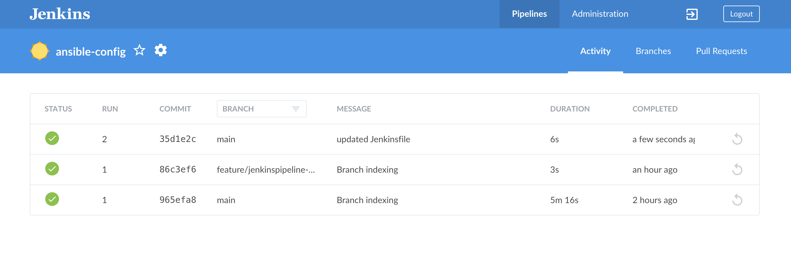
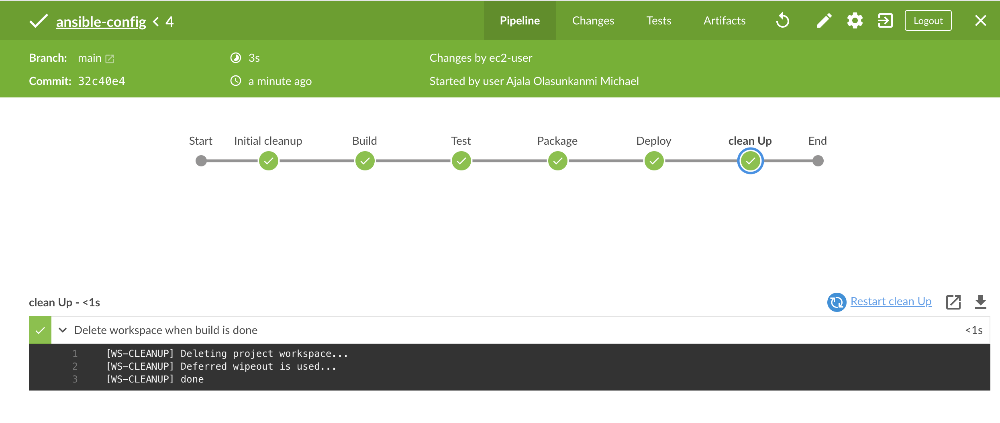
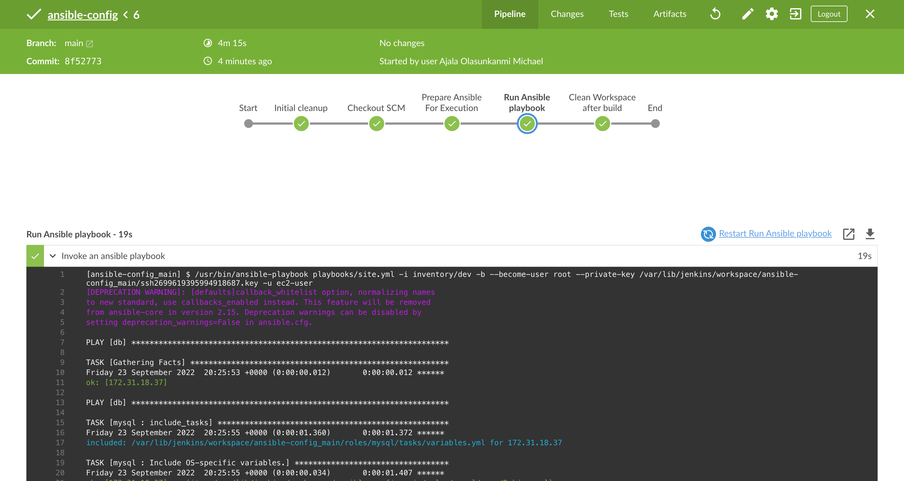
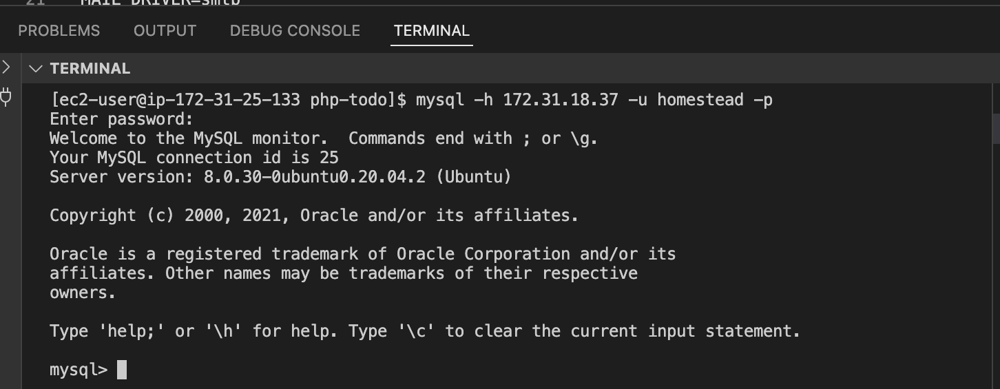
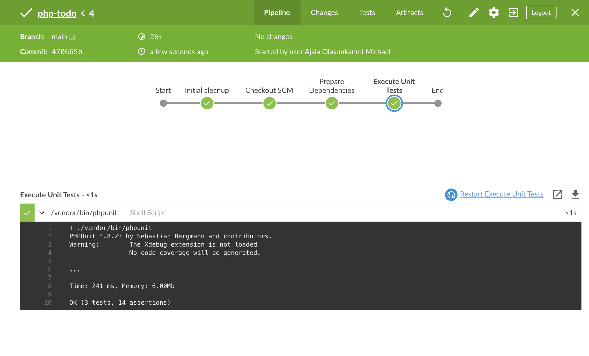
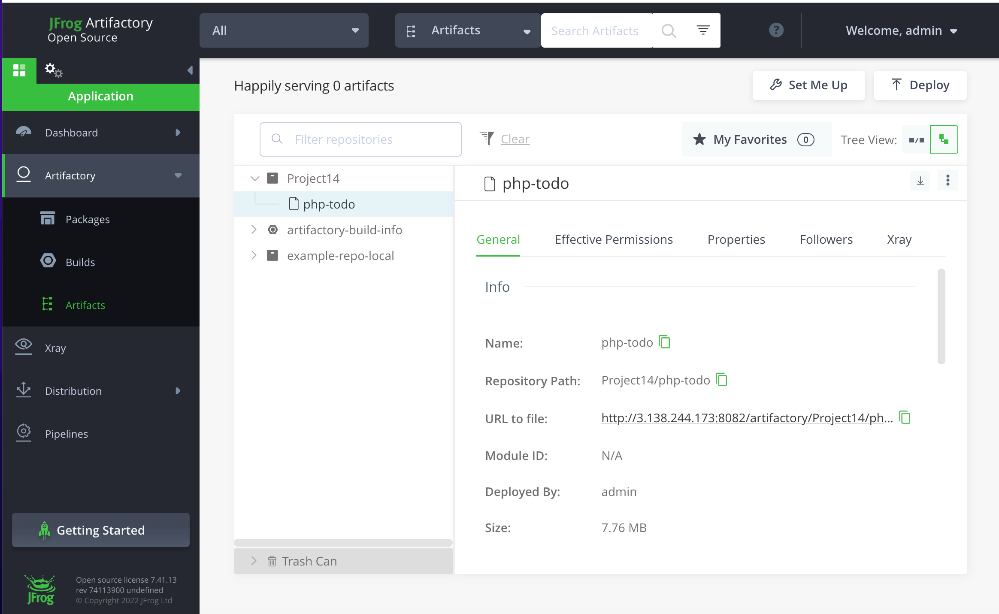
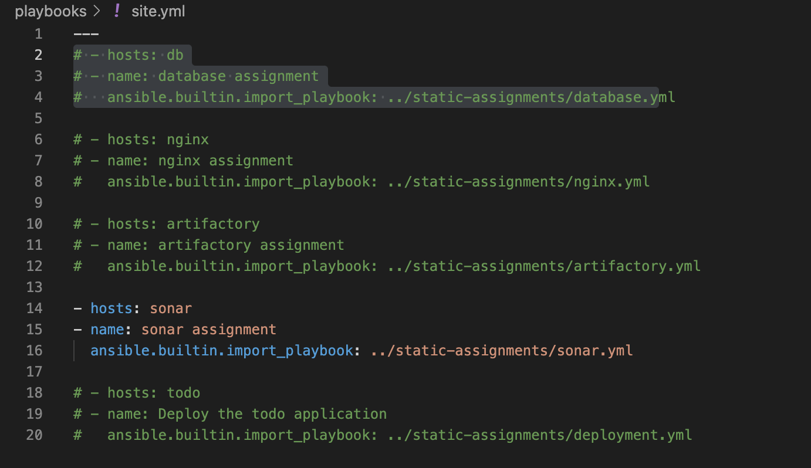

# Experience Continuous Integration With Jenkins | Ansible | Artifactory | Sonarqube | PHP.

This project is continuation of project-13. the concept of CI/CD is implemented whereby php application from github are pushed to Jenkins to run a multi-branch pipeline job(build job is run on each branches of a repository simultaneously) which is better viewed from Blue Ocean plugin. This is done in order to achieve continuous integration of codes from different developers. After which the artifacts from the build job is packaged and pushed to sonarqube server for testing before it is deployed to artifactory from which ansible job is triggered to deploy the application to production environment.

### Configuring Ansible For Jenkins Deployment

In order to run ansible commands from Jenkins UI installed and opened blue ocean plug in in jekins. prior to this step created an ec2 instance for jekins server (RedHat) installed and confirgured Jekins on the server. 

- clicked on create a new pipeline 


- selected Github


- Connect jekins with github


- generated a new token from my github account in order to connect jekins with github


- copied and pasted the token then clickd on connect

- selected my github account and choose the repository i want to work on. then clicked on create a new pipeline 


- Created a directory in the root of ansible-config directory called deploy, and created a file in it called Jenkinsfile.


- Entered the code below in the Jenkins file

```
pipeline {
    agent any

  stages {
    stage('Build') {
      steps {
        script {
          sh 'echo "Building Stage"'
        }
      }
    }
    }
}
```

Note *This pipeline currently has just one stage called Build and the only thing we are doing is using the shell script module to echo Building Stage*

- committed the changes and pushed to github


- back to the Jenkins console clicked on configure to set the path of the jekins, in build configuration under script path and specify the path were the jenkinsfile is.


- Applied and saved the settings 

- Immediately the jenkins file path is set the job will start building automatically, 


- Opened blue ocean on a different tab to view the build pipeline


Notice that this pipeline is a multibranch one. This means, if there were more than one branch in GitHub, Jenkins would have scanned the repository to discover them all and we would have been able to trigger a build for each branch.

Let us see this in action.

- Created a new git branch and named it feature/jenkinspipeline-stages


- at this point we only have the Build stage. added another stage called Test. Pasted the code snippet below and pushed the new changes to GitHub.

```
pipeline {
    agent any

  stages {
    stage('Build') {
      steps {
        script {
          sh 'echo "Building Stage"'
        }
      }
    }

    stage('Test') {
      steps {
        script {
          sh 'echo "Testing Stage"'
        }
      }
    }
    }
}
```

- To make the new branch show up in Jenkins, we need to tell Jenkins to scan the repository from ansible-project.

- Refreshed the page


- Created a pull request to merge the latest code into the main branch then scanned the repository hence build is triggered on the main branch as seen below.




- added more stages into the Jenkins file to simulate below phases.
   1. Package 
   2. Deploy 
   3. Clean up


Note the clean up stage is paramount because For every job created in Jenkins, it creates a workspace for each job, thus if Jenkins perform a lot of job lots of workspace will be created which will affect storage. To avoid this type of issue, its a good practice to ensure that at the beginning of the Jenkinsfile you clean the workspace and at the end also, as seen in the script above.

- Eventually, after mergin the code to the main branch and run the build the pipeline ran succesfully.



### RUNNING ANSIBLE PLAYBOOK FROM JENKINS

- installed ansible
```
sudo yum install ansible -y
```


- Installed ansible in Jekins UI


- Since we are having ansible modules in roles. we will need to install some depedencies this will enable ansible playbook to run properly. 

```
yum install python3 python3-pip wget unzip git -y

python3 -m pip install --upgrade setuptools

python3 -m pip install --upgrade pip

python3 -m pip install PyMySQL

python3 -m pip install mysql-connector-python

python3 -m pip install psycopg2==2.7.5 --ignore-installed

ansible-galaxy collection install community.mysql

ansible-galaxy collection install community.postgresql
```

- From global tool configuration under Ansible. gave descriptive name and path to ansible executable folder as seen below.


### Now, we need to ensure that Ansible runs against the Dev environment successfully.

- Spined up two instances one for Nginx (RedHat) the other for db (ubuntu)

- In the deploy folder, created a file and named it ansible.cfg then copied and pasted the content below inside the file

```
[defaults]
timeout = 160
callback_whitelist = profile_tasks
log_path=~/ansible.log
host_key_checking = False
gathering = smart
ansible_python_interpreter=/usr/bin/python3
allow_world_readable_tmpfiles=true

[ssh_connection]
ssh_args = -o ControlMaster=auto -o ControlPersist=30m -o ControlPath=/tmp/ansible-ssh-%h-%p-%r -o ServerAliveInterval=60 -o ServerAliveCountMax=60 -o ForwardAgent=yes
```


NOTE *by default when ansible is installed, the default configuration file can be found in /etc/ansible/ansible.cfg, the need to create the file in deploy folder is to define and select the default things of our choice and specify how we want the ansible to run, variables to use etc.*

*Jenkins works with file inside the workspace folder.*

*The role path is not specified in the ansible.cfg file we created, it will be defined in the Jenkinsfile.*

*Jenkins needs to export the ANSIBLE_CONFIG environment variable, which must be declared globally and specify where ansible.cfg file is.* hence in the jekinsfile we will have 
```
environment {
  ANSIBLE_CONFIG="${WORKSPACE}/deploy/ansible.cfg"
 }
```

- To enhance jekins ansible connection we need to cofigure global credentials (Dashoard -> Manage Jenkins -> Manage Credentials -> Credentials -> Add Credentials.) filled the blanks appropriately as seen below.


- from Dashboard -> ansib-config -> Pipeline Sytnax, configure path to the playbook and inventory path, ssh-user and colorized output. Using the jenkins pipeline syntax Ansible tool to generate syntax for executing playbook. 


- hence my jekins file.


- Updated inventory/dev with the two intsnaces i created earlier.


- pushed the updated codes to my github repository.

- Scanend the repository from jenkins UI the result is shwon below


*the result above shows that we have succesfully ran ansible playbook from jekins*

Now what if we need to deploy to other environments? we can't possibly update the Jenkinsfile manually to point inventory to those environments? such as sit, uat, pentest, etc. as that is contradictory to our aim of automation. hence, What we will be doing is to parameterise the deployment. So that at the point of execution, the appropriate values are applied.

### Parameterizing Jenkinsfile For Ansible Deployment

- included the parameter scripts below into my jekins file

```
parameters {
      string(name: 'inventory', defaultValue: 'dev',  description: 'This is the inventory file for the environment to deploy configuration')
    }
    
```

- In the Ansible execution section, removed the hardcoded inventory/dev and replaced it with `${inventory}'.

- in the jenkins UI a new tab will be introduced (build with parameters) as seen below


- hence, we can now specify which environment we want to deploy the configuration to.

- pushed the updated code to github and merged it to the main repository. scanned the repository and ran the build.



### CI/CD PIPELINE FOR TODO APPLICATION

Our goal here is to deploy the application onto servers directly from Artifactory rather than from git. Therefore the following steps were taken

- Forked the repository below into my GitHub account

```
https://github.com/darey-devops/php-todo.git
```

- on my jenkins server installed PHP, its dependencies and Composer tool with the codes below.

```
yum module reset php -y

yum module enable php:remi-7.4 -y

yum install -y php  php-common php-mbstring php-opcache php-intl php-xml php-gd php-curl php-mysqlnd    php-fpm php-json

systemctl start php-fpm

systemctl enable php-fpm

curl -sS https://getcomposer.org/installer | php 

sudo mv composer.phar /usr/bin/composer
```

- The image below shows that PHP and composer tool has been installed succesfully


- Installed Jenkins plugins

        Plot plugin
        Artifactory plugin

The plot plugin will be use to display tests reports, and code coverage information. while the Artifactory plugin will be used to easily upload code artifacts into an Artifactory server.


- Spinned up another ec2 instance (Red Hat) for the artifactory server.

- Copied the private ip address into inventory/ci enviroment and configured all settings in the playbook/site.yml , roles and static assignment in order to install Artifactory.

- pushed all changes to the feature-jenkinspipeline-stages branch, created a pull request then merged to the main branch. 

- hence, updated the jekins file to pull the code from main branch. ran the build in jekins ui against ci environment, the result is shown below.

 

- Accessed the artifactory public ip address with port 8081

- Logged in with the default user name and password (admin password). changed the password to my desired password.


- Created a repository (Create repository -> Select Package Type -> Generic, entered Repository Key as Project14, save and finish).


- In Jenkins UI configured Artifactory (Configure the server ID, URL and Credentials, run Test Connection.) as seen below.


### Integrate Artifactory repository with Jenkins


- Created a Jenkinsfile in the php-todo folder, and copied the content below in it.

```
pipeline {
    agent any

  stages {

     stage("Initial cleanup") {
          steps {
            dir("${WORKSPACE}") {
              deleteDir()
            }
          }
        }

    stage('Checkout SCM') {
      steps {
            git branch: 'main', url: 'https://github.com/Revelation69/php-todo.git'
      }
    }

    stage('Prepare Dependencies') {
      steps {
             sh 'mv .env.sample .env'
             sh 'composer install'
             sh 'php artisan migrate'
             sh 'php artisan db:seed'
             sh 'php artisan key:generate'
      }
    }
  }
}
```

Our php-todo application needs to connect to our database. Therefore, we need to set up our database server with a database and a user named 'homestead'.

- Updated mysql roles in other for us to run ansible playbook to create a database and a user on our database server.


Note *the Ip addressed used is the jenkins private ip address this implies that the user we are creating must be from the Ip address of the jenkins server*

- Pushed the changes to github then ran the build against parameter dev. The result is seen below


- The image below shbows that the database and user were successfully created.


- Set the bind address of the database of the MYSQL server to allow connections from remote hosts.

```
sudo vi /etc/mysql/mysql.conf.d/mysqld.cnf
```

- Changed bind-address = 0.0.0.0 and restarted mysql 
```
sudo systemctl restart mysql
```

- installed mysql client on Jenkins Server

```
sudo yum install mysql-client
```
- Updated the database connectivity requirements in the .env.sample file to look like this.


- Also tried connecting to the database mysql console from my jenkins server (mysql client) 
```
mysql -h 172.31.18.37 -u homestead -p
```
 *the image below shows that we can connect successfully to the data base from jekins server*

 

 Notice there are three stages in the jekinsfile in php-todo repository. 

 - The first stage performs a clean-up which always deletes the previous workspace before running a new one

 - The second stage connects to the php-todo repository

 - The third stage performs a shell scripting which renames .env.sample file to .env, then installs composer which is used by PHP to install all the dependent libraries used by the application and then php artisan uses the .env to setup the required database objects


- Created a new pipeline in blue ocean and linked the php-todo git link to it, the build got triggered since we have a jenkinsfile in it. The result is seen below


- logged into the database to verify the tables that has been created.


- Updated the Jenkinsfile to include Unit tests step

```
stage('Execute Unit Tests') {
      steps {
             sh './vendor/bin/phpunit'
      } 
    }
```



### Code Quality Analysis

This is one of the areas where developers, architects and many stakeholders are mostly interested in as far as product development is concerned. As a DevOps engineer, WE also have a role to play. Especially when it comes to setting up the tools.

For PHP the most commonly tool used for code quality analysis is phploc. The data produced by phploc can be ploted onto graphs in Jenkins.

- Adding Code Quality stage with phploc tool and will save the output in build/logs/phploc.csv:

```
stage('Code Analysis') {
      steps {
        sh 'phploc app/ --log-csv build/logs/phploc.csv'

      }
    }
```

- Installed phploc

```
sudo dnf --enablerepo=remi install php-phpunit-phploc
wget -O phpunit https://phar.phpunit.de/phpunit-7.phar
chmod +x phpunit
```
- Added the plot code coverage report stage

```
 stage('Plot Code Coverage Report') {
      steps {

            plot csvFileName: 'plot-396c4a6b-b573-41e5-85d8-73613b2ffffb.csv', csvSeries: [[displayTableFlag: true, exclusionValues: 'Lines of Code (LOC),Comment Lines of Code (CLOC),Non-Comment Lines of Code (NCLOC),Logical Lines of Code (LLOC)                          ', file: 'build/logs/phploc.csv', inclusionFlag: 'INCLUDE_BY_STRING', url: '']], group: 'phploc', numBuilds: '100', style: 'line', title: 'A - Lines of code', yaxis: 'Lines of Code'
            plot csvFileName: 'plot-396c4a6b-b573-41e5-85d8-73613b2ffffb.csv', csvSeries: [[displayTableFlag: true, exclusionValues: 'Average Class Length (LLOC),Average Method Length (LLOC),Average Function Length (LLOC)', file: 'build/logs/phploc.csv', inclusionFlag: 'INCLUDE_BY_STRING', url: '']], group: 'phploc', numBuilds: '100', style: 'line', title: 'C - Average Length', yaxis: 'Average Lines of Code'
            plot csvFileName: 'plot-396c4a6b-b573-41e5-85d8-73613b2ffffb.csv', csvSeries: [[displayTableFlag: true, exclusionValues: 'Directories,Files,Namespaces', file: 'build/logs/phploc.csv', inclusionFlag: 'INCLUDE_BY_STRING', url: '']], group: 'phploc', numBuilds: '100', style: 'line', title: 'B - Structures Containers', yaxis: 'Count'
            plot csvFileName: 'plot-396c4a6b-b573-41e5-85d8-73613b2ffffb.csv', csvSeries: [[displayTableFlag: true, exclusionValues: 'Cyclomatic Complexity / Lines of Code,Cyclomatic Complexity / Number of Methods ', file: 'build/logs/phploc.csv', inclusionFlag: 'INCLUDE_BY_STRING', url: '']], group: 'phploc', numBuilds: '100', style: 'line', title: 'D - Relative Cyclomatic Complexity', yaxis: 'Cyclomatic Complexity by Structure'      
            plot csvFileName: 'plot-396c4a6b-b573-41e5-85d8-73613b2ffffb.csv', csvSeries: [[displayTableFlag: true, exclusionValues: 'Classes,Abstract Classes,Concrete Classes', file: 'build/logs/phploc.csv', inclusionFlag: 'INCLUDE_BY_STRING', url: '']], group: 'phploc', numBuilds: '100', style: 'line', title: 'E - Types of Classes', yaxis: 'Count'
            plot csvFileName: 'plot-396c4a6b-b573-41e5-85d8-73613b2ffffb.csv', csvSeries: [[displayTableFlag: true, exclusionValues: 'Methods,Non-Static Methods,Static Methods,Public Methods,Non-Public Methods', file: 'build/logs/phploc.csv', inclusionFlag: 'INCLUDE_BY_STRING', url: '']], group: 'phploc', numBuilds: '100', style: 'line', title: 'F - Types of Methods', yaxis: 'Count'
            plot csvFileName: 'plot-396c4a6b-b573-41e5-85d8-73613b2ffffb.csv', csvSeries: [[displayTableFlag: true, exclusionValues: 'Constants,Global Constants,Class Constants', file: 'build/logs/phploc.csv', inclusionFlag: 'INCLUDE_BY_STRING', url: '']], group: 'phploc', numBuilds: '100', style: 'line', title: 'G - Types of Constants', yaxis: 'Count'
            plot csvFileName: 'plot-396c4a6b-b573-41e5-85d8-73613b2ffffb.csv', csvSeries: [[displayTableFlag: true, exclusionValues: 'Test Classes,Test Methods', file: 'build/logs/phploc.csv', inclusionFlag: 'INCLUDE_BY_STRING', url: '']], group: 'phploc', numBuilds: '100', style: 'line', title: 'I - Testing', yaxis: 'Count'
            plot csvFileName: 'plot-396c4a6b-b573-41e5-85d8-73613b2ffffb.csv', csvSeries: [[displayTableFlag: true, exclusionValues: 'Logical Lines of Code (LLOC),Classes Length (LLOC),Functions Length (LLOC),LLOC outside functions or classes ', file: 'build/logs/phploc.csv', inclusionFlag: 'INCLUDE_BY_STRING', url: '']], group: 'phploc', numBuilds: '100', style: 'line', title: 'AB - Code Structure by Logical Lines of Code', yaxis: 'Logical Lines of Code'
            plot csvFileName: 'plot-396c4a6b-b573-41e5-85d8-73613b2ffffb.csv', csvSeries: [[displayTableFlag: true, exclusionValues: 'Functions,Named Functions,Anonymous Functions', file: 'build/logs/phploc.csv', inclusionFlag: 'INCLUDE_BY_STRING', url: '']], group: 'phploc', numBuilds: '100', style: 'line', title: 'H - Types of Functions', yaxis: 'Count'
            plot csvFileName: 'plot-396c4a6b-b573-41e5-85d8-73613b2ffffb.csv', csvSeries: [[displayTableFlag: true, exclusionValues: 'Interfaces,Traits,Classes,Methods,Functions,Constants', file: 'build/logs/phploc.csv', inclusionFlag: 'INCLUDE_BY_STRING', url: '']], group: 'phploc', numBuilds: '100', style: 'line', title: 'BB - Structure Objects', yaxis: 'Count'

      }
    }
```

- pushed the changes to github and scanned the repository in jenkins UI to trigger Build.


- Added the package artifacts stage which archives the application code

```
stage ('Package Artifact') {
    steps {
            sh 'zip -qr php-todo.zip ${WORKSPACE}/*'
     }
    }
```

- Installed zip
```
sudo yum install zip -y
```

- Added the below stage to publish the resulted artifact into Artifactory

```
stage ('Upload Artifact to Artifactory') {
          steps {
            script { 
                 def server = Artifactory.server 'artifactory-server'                 
                 def uploadSpec = """{
                    "files": [
                      {
                       "pattern": "php-todo.zip",
                       "target": "<name-of-artifact-repository>/php-todo",
                       "props": "type=zip;status=ready"

                       }
                    ]
                 }""" 

                 server.upload spec: uploadSpec
               }
            }

        }
```

note *You can only deploy to artifactory, if a unit test has been done on it*

- pushed the changed and scan the repository so the build can trigger. The result is shown in the image below.




- spinned up an ec2 instance (Red Hat) for todo server.

- updated the Private Ip address of the todo server in dev file.


- Updated playbook/site.yml to deploy the todo application


- Deploy the application to the dev environment by launching Ansible pipeline
```
stage ('Deploy to Dev Environment') {
      steps {
        build job: 'ansible-config/main', parameters: [[$class: 'StringParameterValue', name: 'env', value: 'dev']], propagate: false, wait: true
      }
    }
```

The build job used in the step above tells Jenkins to start another job. In this case it is the ansible-config job, and we are targeting the main branch. Hence, we have ansible-config/main. Since the Ansible project requires parameters to be passed in, we have included this by specifying the parameters section. The name of the parameter is env and its value is dev. Meaning, deploy to the Development environment.

- Updated deployment.yml file as seen below


- The password was generated from artifacory UI, steps can be seen below.


1. 

2. 

3. 


- pushed the codes (changes made) from both directories (ansible-config and php-todo) to github then scanned the repository so as to trigger the build.


Even though we have implemented Unit Tests and Code Coverage Analysis with phpunit and phploc, we still need to implement Quality Gate to ensure that ONLY code with the required code coverage, and other quality standards make it through to the environments.

To achieve this, we need to configure SonarQube – An open-source platform developed by SonarSource for continuous inspection of code quality to perform automatic reviews with static analysis of code to detect bugs, code smells, and security vulnerabilities.

### SORNAQUBE 

- Launched an ec2 instance (ubuntu, t2-medium), to serve as sornaqube server.

- Updated inventory/ci and site.yml as seen below




- made sure the ansible machine can talk to the server via SSH agent, by confirming ssh-add -l.

- Pushed the changes to github and build with parameter ci from the jeknins UI, the result can be seen below.


- Accessed the sonarqube url from a browser using port 9000


- In Jenkins, installed SonarScanner plugin 


- Navigate to configure system in Jenkins. Added SonarQube server as shown below:


- Generate authentication token in SonarQube

- Configured Quality Gate Jenkins Webhook in SonarQube, the url is pointing to my jenkins server.


- Setup SonarQube scanner from Jenkins – Global Tool Configuration


- Updated Jenkins Pipeline to include SonarQube scanning and Quality Gate, it should be placed before "Package Artifact".

```
    stage('SonarQube Quality Gate') {
        environment {
            scannerHome = tool 'SonarQubeScanner'
        }
        steps {
            withSonarQubeEnv('sonarqube') {
                sh "${scannerHome}/bin/sonar-scanner"
            }

        }
    }
```

- updated the sonar-scanner.properties for the build to work:

```
cd /var/lib/jenkins/tools/hudson.plugins.sonar.SonarRunnerInstallation/SonarQubeScanner/conf/

sudo vi sonar-scanner.properties
```

- The configuration related to php-todo project was added, as seen below.

```
sonar.host.url=http://<SonarQube-Server-IP-address>:9000
sonar.projectKey=php-todo
#----- Default source code encoding
sonar.sourceEncoding=UTF-8
sonar.php.exclusions=**/vendor/**
sonar.php.coverage.reportPaths=build/logs/clover.xml
sonar.php.tests.reportPath=build/logs/junit.xml
```

- Scanned the repository to run the job.


The quality gate we just included has no effect. Why? Well, because if we go to the SonarQube UI, we will realise that we just pushed a poor-quality code onto the development environment.


There are bugs, and there is 0.0% code coverage. (code coverage is a percentage of unit tests added by developers to test functions and objects in the code)

- Therefore we update the jenkins file to look like this

```
 stage('SonarQube Quality Gate') {
      when { branch pattern: "^develop*|^hotfix*|^release*|^main*", comparator: "REGEXP"}
        environment {
            scannerHome = tool 'SonarQubeScanner'
        }
        steps {
            withSonarQubeEnv('sonarqube') {
                sh "${scannerHome}/bin/sonar-scanner -Dproject.settings=sonar-project.properties"
            }
            timeout(time: 1, unit: 'MINUTES') {
                waitForQualityGate abortPipeline: true
            }
        }
    }
```
- Thus, the result after running the jenkins build.


From the result above we can see that the code didn't pass quality gate test this implies that there are bugs in the code which the developer(s) need to fix.


